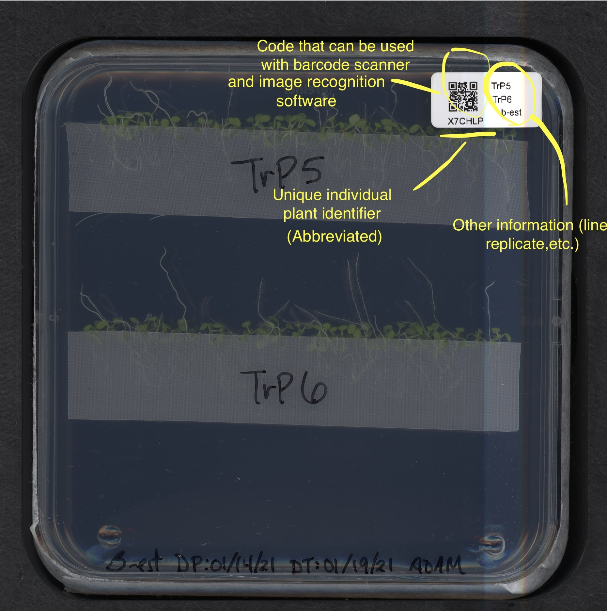
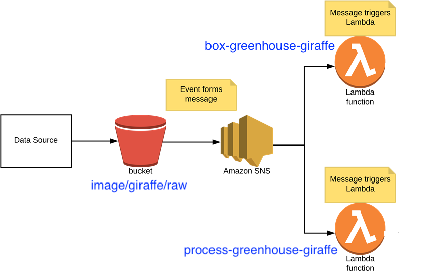

# Salk HPI Data System
The main Salk HPI Data System for tracking plants and their phenotypic data in the lab, greenhouse, and field. Integrates with QR code tracking. Makes querying past experiments (+ images, etc.) and environmental data easier.

We don't currently have a wiki, so the best context for code is this readme and the readmes that are closest to each bit of code. However, there are some generally useful notes you can find here: https://www.notion.so/Salk-Harnessing-Plants-Initiative-Software-Engineering-Wiki-8b4c2524c41b4a4dae847a4b61cde92a

# Related repos

## S3 uploader services running as clients on imager computers
* https://github.com/Salk-Harnessing-Plants-Initiative/aws-s3-desktop-uploader: Used for uploading plate MultiScan images (.tif) to the data system
* https://github.com/Salk-Harnessing-Plants-Initiative/greenhouse-giraffe-uploader: Used for uploading top-down photos (.png) of greenhouse plants to the data system
* https://github.com/Salk-Harnessing-Plants-Initiative/plant-cylinder-uploader: Used for uploading rotational photos of plants grown in transparent cylinders

## Tools for researchers
* https://github.com/Salk-Harnessing-Plants-Initiative/excel-barcode-scanner-guide: Encode `plant_id` or `container_id` into a QR/barcode label and use a barcode scanner for rapid phenotypic data entry. The resultant spreadsheet can be uploaded to the data system
* https://github.com/Salk-Harnessing-Plants-Initiative/data-system-tools: Tools for cleaning data before uploading it into the data system, and tools for querying the data system for biocomputation research projects (e.g. stitching greenhouse Giraffe images for foliage analysis)

# Architecture
We use Postgres for our database, AWS Lambda for the backend, Retool for the frontend, and have various scripts running on client computers to upload images.

## S3 structure
`image/`:
* `giraffe/`:
	* `raw/`
* `plate/`:
	* `raw/`
	* `thumbnail/`
* `cylinder/`:
	* `raw/`:
		* `{plant_id}/`:
			* `{image_timestamp_date}/`

`tmp/`:
* `csv/`

## QR code integration
One of the main features of this data system is its ability to process QR codes to automate some of our processes. QR codes are conceptually simple in the sense that you can technically encode any string you want into them. For our purposes, we **strictly** encode an ID into the QR code (and **not** arbitrary metadata) so that the code can be integrated with the rest of our data system in a very logical manner. 

 

### Explained: plant_id vs container_id vs section_name
This might be a little confusing at first, but basically we have 3 different categories of QR codes for use in different contexts to integrate all the diverse data we work with.

* **`plant_id`** is the globally unique identifier of a literal plant individual/organism. It's a 1:1 relationship. If you have 1 seedling or 1 corn stalk, the `plant_id` is just for that seedling or corn stalk. Not for a species, not for a variety, not for a line or accession.

* **`container_id`** is the globally unique identifier of the container some plant(s) are grown in. Such as an agar plate, a plastic cylinder, a pocket of a tray, or a plastic pot. This is the container where you are actually growing the plant(s) for the experiment, so if you're sprouting the seedlings somewhere and then transferring them to a container, we are referring to the post-transfer container. 
	* A `plant_id` can only have one `container_id` (and they're associated when the IDs are originally generated), but a `container_id` can have multiple `plant_id`s. So if you have an agar plate with 12 seedlings in it, for instance, each seedling will have a `plant_id`, and all of those `plant_id`s will be hard linked to a single `container_id`. (There's a thing called a `containing_index` which tells you the relative location of a `plant_id` inside a `container_id`).

* **`section_name`** is the identifier of a partition of a greenhouse or outdoor crop field. It is constant and exists regardless of what plants are growing on it. A good example of this is each growing table in the Encinitas greenhouse, such as `EG-01-01`,..., `EG-01-10`, ..., `EG-04-01`,..., `EG-04-10`. Another example of this might be various subplots of land where we would do a field study. Though the plants may come and go, the `section_name` of a particular growing table stays the same. (Never use `section_id` which is deprecated/legacy).

#### Rules

The thing is that we use QR codes both as a way to automatically sort our images and as a barcode that you can scan with a handheld barcode scanner. Sometimes these goals are at odds with each other, which is how it's led us to the following rules about which class of QR codes should get encoded: 

* If you are working with agar plates, you should always encode the `container_id` as the QR code on the label during label-printing. (This comes from the design consideration that agar plates almost always have many seedlings growing in them. And also that people only do digital--not physical--phenotyping of agar plates, so nobody is using a handheld barcode scanner). **All agar plate image scans will only be sorted by `container_id`-based QR codes.** 

* If you are working with plastic cylinders or normal plant pots, you should almost always encode the `plant_id` as the QR code on the label, and ensure that you have one label for each plant. This is because someone will likely be using a handheld barcode scanner to scan each plant when doing physical phenotypic measurements and manual data entry. However, **all cylinder images, 3D scan images, and X-ray images will be capable of being sorted by both `plant_id` and `container_id`-based QR codes.** 
	* This is just to make life easier because the people who do plates+cylinders will be used to using `container_id`, whereas the people who do physical phenotyping will be used to using `plant_id`.
	* But as a developer working on this data system, you should know that all images with the exception of Greenhouse Giraffe images should ultimately get identified by `container_id` in order to make querying easy and unified later. (So transform given `plant_id`s to `container_id` on the backend). 

* If you are imaging entire partitions of a greenhouse or crop field, encode `section_name` as the QR code used on signs to identify the section. For instance, in the Encinitas greenhouse we use `section_name` as the QR code on big laminated signs so that when we take top-down images of the growing tables using the Greenhouse Giraffe or otherwise, the images get associated with that section. **All Greenhouse Giraffe images will only be sorted by `section_name`-based QR codes.** 

## Greenhouse giraffe lambdas
Most of the other lambdas are not tied together in any complicated way, but since the greenhouse giraffe ones are a special case I've diagramed the relationship here for you in case it's helpful:

 

